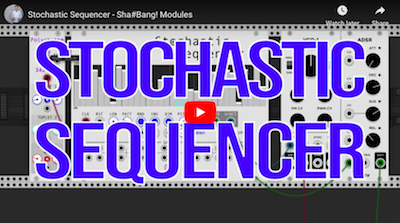

# Sha#Bang! Modules

A collection of innovative, probabilistic, generative, and rhythmically complex modules for [VCVRack](https://vcvrack.com/). Created by [Jeremy Muller](http://jeremymuller.com/). These modules are free for download but please consider a donation through [PayPal](https://www.paypal.com/paypalme/jeremysmuller).

Add these modules to VCVRack through the [Rack library](https://library.vcvrack.com/?brand=Sha%23Bang!%20Modules).

## Contents:

* [Cosmosis](#cosmosis)
* [Neutrinode](#neutrinode)
* [Orbitones](#orbitones)
* [Photron](#photron)
* [PhotronPanel](#photron-panel)
* [PolyrhythmClock](#polyrhythm-clock)
* [QubitCrusher](#qubit-crusher)
* [RandGates](#randgates)
* [StochSeq](#stochseq) :tv:
* [StochSeq4](#stochseq4) :tv:
* [Talea](#talea)

---

### Cosmosis

*A continuous sequencer based on constellations where time can move left->right, right->left, up->down, and down->up.*

Click anywhere to add/drag new stars. To remove stars click/drag them out of the dark display area.

##### RIGHT-CLICK MENU:
- Polyphony.
##### BUTTONS:
- `PLAY` starts the sequencer.
- `CLR` removes all stars.
- `POS` randomizes positions of stars.
- `RAD` randomizes the radii of stars.
##### INPUTS:
- `PLAY` trigger starts/stops the sequencer.
- `SPEED` control voltage manipulates the current speed.
- `RESET` trigger resets the current sequence position.
- Root note input will accept V/OCT to set the root note.
- `POS` accepts gate that triggers randomizing positions of stars.
- `RAD` accepts gate that triggers randomizing radii of stars.
##### KNOBS:
- `SPEED` tempo of sequencer.
- `PATT` sets the constellation pattern.
- Two knobs control the root note and the scale. The Messiaen modes are based on the wonderful French composer, Olivier Messiaen and his [modes of limited transposition](https://en.wikipedia.org/wiki/Mode_of_limited_transposition) found in his book *The Technique of My Musical Language*.
- Chords like MM7, Mm7, mm7, etc. are based on [seventh chords](https://en.wikipedia.org/wiki/Seventh_chord).
- `OCT` controls the octaves of individual sequencers.
- `MODE` sets which direction time will traverse the stars.
##### SWITCH:
- `PITCH` left side will take pitch from the radius of particles. The right side will take pitch based on the X or Y position (width or height respectively) in the display. If the `MODE` is set to either Blue or Red, in which case time travels down or up, pitch is taken from the horizontal position of the stars. The left switch is good if you'd like to generate randomness in the pitches, however, if you want more control over the pitch then select the right switch.
##### OUTPUTS:
- `GATES` output pulses.
- `V/OCT` outputs ±5 volts.

---

### Neutrinode

*A unique visual-based sequencer where time moves from the center of the 4 independent nodes out to the connected particles. Can generate interesting rhythmic textures and can be animated so that the textures change over time.*

Click on nodes to position them. Click anywhere else to add/drag new particles. To remove particles click/drag them out of the dark display area.

##### RIGHT-CLICK MENU:
- Collisions are turned on or off for the nodes.
- Polyphony.
##### BUTTONS:
- `PLAY` turns on/off all nodes.
- `MOVE` each node will randomly move around the dispay area.
- `CLR` removes all particles.
- `ON` turns on/off individual nodes.
##### INPUTS:
- `PLAY` trigger starts/stops the generator.
- `BPM` control voltage manipulates the current bpm.
- `MOVE` trigger turns on/off the random movement of nodes.
- Root note input will accept V/OCT to set the root note.
##### KNOBS:
- `BPM` tempo of all nodes.
- `SPEED` is the velocity of movement of nodes when `MOVE` is switched on.
- Two knobs control the root note and the scale. The Messiaen modes are based on the wonderful French composer, Olivier Messiaen and his [modes of limited transposition](https://en.wikipedia.org/wiki/Mode_of_limited_transposition) found in his book *The Technique of My Musical Language*.
- Chords like MM7, Mm7, mm7, etc. are based on [seventh chords](https://en.wikipedia.org/wiki/Seventh_chord).
- `OCT` controls the octaves of individual nodes.
##### SWITCHES:
- `PITCH` left side will take pitch from the radius of particles. The right side will take pitch based on the Y position (height) in the display. The left switch is good if you'd like to generate randomness in the pitches, however, if you want more control over the pitch then select the right switch.
##### OUTPUTS:
- `GATES` and `V/OCT` output only from the corresponding node color.
- `ALL` outputs all nodes.

*:warning: There are a maximum of 16 particles (for 16 polyphonic channels) per node. However, when using the `ALL` outputs, there is potential to reach that maximum (16 x 4 = 64) in which case it does voice stealing.*

---

### Orbitones

*Physics-based animated LFO with 4 independent attractors.*

Click on the attractors to move position them where you want. Click anywhere else to add particles.

##### RIGHT-CLICK MENU:
- Polyphony.
- Particle trails: 
  - off
  - white
  - red/blue shift (based on velocity of particles)
- Particle boundaries:
  - on (particles are bound by the display area and will bounce off edges)
  - off (particles are able to leave the display area)
##### BUTTONS:
- `RMV` removes one particle.
- `CLR` clears all particles.
- `MOVE` trigger turns on/off the random movement of attractors.
##### KNOBS:
- `ON` turns on/off individual attractors.
- `G` scales the individual attractors' gravity.
- `G` (big knob) main gravity control for all attractors.
##### INPUTS:
- `MOVE` trigger turns on/off the random movement of attractors.
- `G` takes a CV using this formula: `G` * 2V.
##### OUTPUTS:
- `MONO OUTS`:
  - `AVG` average x/y voltage of all particles.
  - `MAX` maximum x/y voltage of all particles.
  - `MIN` minimum x/y voltage of all particles.
- `POLY OUTS`:
  - `X Y` positions of particles correspond to ±5 volts.
  - `-X -Y` opposite positions of particles correspond to ±5 volts.
  - `velX velY` velocities of particles correspond to ±5 volts.

---

### Photron

*An animated visualizer with inputs. Uses color flocking based on the Craig Reynolds boids flocking algorithm.*

##### RIGHT-CLICK MENU:
- Processing rate (for those with slower CPUs). Keep in mind, if you slow the processing rate down, it'll help your CPU but the animation will also slow down.
##### BUTTON:
- color version or black & white version.
##### INPUTS:
- Top 4 inputs (zero volts is default values):
  - CV controls the separation of colors between adjacent blocks. Higher voltage = more separation.
  - CV controls the alignment of block colors which is their rate of change. Higher voltage = more alignment and thus their color velocities will become the same.
  - CV controls the cohesion of block colors which is converging on a single color. Higher voltage = more cohesion and thus their colors will quickly become the same and Photron will look like one color.
  - V/OCT controls the target color for Photron. Blocks will drift towards the target color and hover around it. See the image below for corresponding notes & colors:

- Bottom 3 inputs are triggers:
  - color version of black & white version.
  - invert colors.
  - reinitialize all blocks (alternates between randomizing all colors or 4 colors in 4 quadrants).

---

### Photron Panel

*An animated panel visualizer. Small panel version of Photron.*

- `Initialize` will set the colors in a quadrant of Purple, Blue, Aqua, and Red.
- `Randomize` will randomize all colors.

##### RIGHT-CLICK MENU:
- `Processing rate` (for those with slower CPUs). Keep in mind, if you slow the processing rate down, it'll help your CPU but the animation will also slow down.
- `Mode` color or black & white.

---

### Polyrhythm Clock

*A clock featuring three layers of embedded rhythms. It's easy to multiply and/or divide the clock with virtually any rhythm you want using this clock.*

##### RIGHT-CLICK MENU:
- External Clock Mode:
  - `CV` controls bpm (beats per minute) based on the input voltage using this formula: 120 * 2V.
  - `12 PPQN` controls bpm based on 12 pulses per quarter note.
  - `24 PPQN` controls bpm based on 24 pulses per quarter note.
- If the mode is set to either of the `PPQN` modes, the clock will turn on automatically when it receives a pulse. It will also turn off automatically after it times out from not receiving any more pulses.
##### INPUT:
- `EXT` is an external clock to control the PolyrhythmClock determined by the External Clock Mode.
##### BUTTON:
- on or off
##### KNOBS:
- large main knob at the top controls the bpm (beats per minute).
- left-side knobs within each tuplet controls the numerator part of the fraction (or ratio).
- right-side knobs within each tuplet controls the denominator part of the fraction (or ratio).
- middle solid-color knobs within each tuplet controls the probability of outputting a pulse.
##### OUTPUTS:
- first one outputs the current bpm.
- `TUPLET 1` outputs the ratio compared to the bpm.
- `TUPLET 2` outputs the ratio compared to `TUPLET 1`.
- `TUPLET 3` outputs the ratio compared to `TUPLET 2`.

---

### Qubit Crusher

*A bit crusher and downsampler using fractional rates with the ability to modulate bit rate & sample rate, or randomly trigger new bit rates & sample rates.*

##### INPUTS:
- `IN` input signal to be processed.
- `TRG`s both inputs accept gates that trigger random bit rates and/or sample rates.
- Inputs connected to `MOD` knob accept modulation sources (i.e. LFO).
##### KNOBS:
- `BITS` sets bit rate. This is overridden by `TRG` input.
- `SAMP` sets sample rate. This is overriden by `TRG` input.
- `MOD`s set the amount of modulation from modulation signal.
##### OUTPUT:
- `OUT` output signal.

---

### RandGates

*Randomly outputs one of the 4 inputs.*

##### INPUTS:
- `TRG` randomizes the output
- `INS` (purple, blue, aqua, red) are any type of input, i.e. gates or ±5 volts.
##### KNOB:
- Gives a higher probability weight to the chosen input. All the way to the right is uniform randomness.
##### OUTPUT:
- `OUT` outputs either the randomly chosen input as either a pulse or ±5 volts.

---

### StochSeq

*A sequencer that uses stochastic (probabilistic) patterns. The outputs can be used as gates (triggered based on probability) or as ±5 volts (probability is converted to voltage).*

Click and/or drag to draw your own patterns!

Watch the tutorial:

##### INPUTS:
- `CLK` controls timing.
- `RST` resets sequence to beginning of timeline.
##### KNOBS:
- `LEN` length of the sequence.
- `PATT` selects from preset patterns.
- `SPREAD` determines the pitch spread of the `V/OCT` output.
  - Center will always be the same pitch.
  - Right of center: 0% to 100% in sliders correspond to low to high pitches.
  - Left of center: 0% to 100% in sliders correspond to high to low pitches (inverted).
- Two knobs control the root note and the scale. The Messiaen modes are based on the wonderful French composer, Olivier Messiaen and his [modes of limited transposition](https://en.wikipedia.org/wiki/Mode_of_limited_transposition) found in his book *The Technique of My Musical Language*.
- Chords like MM7, Mm7, mm7, etc. are based on [seventh chords](https://en.wikipedia.org/wiki/Seventh_chord).
##### BUTTONS:
- `RND` randomizes all probabilities.
- `INV` inverts all probabilities.
- `DIM` cuts the current pattern in half and repeats. Keep clicking this button to continue to diminish the pattern.
##### OUTPUTS:
- `GATE` outputs a pulse based on the probability of the current sequence position. (i.e. a slider at 50% will only trigger a pulse half of the time)
- `V/OCT` outputs pitch based on the slider position and `SPREAD` knob, regardless of probability of the event.
- `GATES` outputs correspond to each position in the sequence.

---

### StochSeq4

*A sequencer that uses four independent stochastic (probabilistic) patterns. The outputs can be used as gates (triggered based on probability) or as ±5 volts (probability is converted to voltage).*

Click and/or drag to draw your own patterns!

Watch the tutorial:

##### INPUTS:
- `MCLK` controls timing of all patterns (overrides all individual clocks).
- `CLK` controls timing of individual patterns.
- `RST` resets sequences to beginning of timeline.
- `RND` gate input randomizes all probabilities.
- `INV` gate input inverts all probabilities.
- `DIM` gate input cuts the current pattern in half and repeats.
##### KNOBS:
- `LEN` length of the individual sequence.
- `PATT` selects from preset patterns.
- `SPREAD` determines the pitch spread of the `V/OCT` output.
  - Center will always be the same pitch.
  - Right of center: 0% to 100% in sliders correspond to low to high pitches.
  - Left of center: 0% to 100% in sliders correspond to high to low pitches (inverted).
- Two knobs control the root note and the scale just like [StochSeq](#stochseq).
##### BUTTONS:
- `RND` randomizes all probabilities.
- `INV` inverts all probabilities.
- `DIM` cuts the current pattern in half and repeats. Keep clicking this button to continue to diminish the pattern.
##### OUTPUTS:
- `GATE` outputs a pulse based on the probability of the current individual sequence position. (i.e. a slider at 50% will only trigger a pulse half of the time)
- `V/OCT` outputs pitch based on the slider position and `SPREAD` knob, regardless of probability of the event.

---

### Talea

*An arpeggiator with polyrhythmic capabilities dependent upon note intervals.*

##### RIGHT-CLICK MENU:
- External Clock Mode:
  - `CV` controls bpm (beats per minute) based on the input voltage using this formula: 120 * 2V.
  - `12 PPQN` controls bpm based on 12 pulses per quarter note.
  - `24 PPQN` controls bpm based on 24 pulses per quarter note.
  - If the mode is set to either of the `PPQN` modes, the clock will turn on automatically when it receives a pulse. It will also turn off automatically after it times out from not receiving any more pulses.
- Polyrhythm Mode:
  - `Fixed` means each note is fixed and centered around middle C (C4, volts = 0.0). This note will take the current tempo of the BPM knob and all other notes are a ratio based on this note/tempo.
  - `Movable` means that the first note played will take the current tempo of the BPM knob and all other notes are a ratio based on this first note/tempo.
##### INPUT:
- `EXT` is an external clock to control the Talea BPM determined by the External Clock Mode.
- `V/OCT` takes input voltage.
- `GATE` input gates when note is held.
##### BUTTON:
- on or off
- `HOLD` will hold pattern. Is overriden when you release all notes and start a new note.
- `OCT` will add octaves to the pattern:
  - No light = 1 octave
  - Purple light = 2 octaves
  - Blue light = 3 octaves
  - Aqua light = 4 octaves
  - Red light = 5 octaves
- `POLYRHYTHM` will turn on or off the polyrhythm arpeggiator. If off, Talea acts like a conventional arpeggiator.
##### KNOBS:
- large main knob at the top controls the bpm (beats per minute).
- `GATE` knob control the percentage amount the gate is on. 
- the pattern mode controls the order of notes when `POLYRHYTHM` is turned off. These are:
  - `↑` ascending order
  - `↓` descending order
  - `2x` each note plays twice in ascending order
  - `⚡︎` in order of which they were played
  - `R` random
##### OUTPUTS:
- `V/OCT` outputs pitch.
- `GATE` outputs gates determined by arpeggiator rhythms.

##### TUNINGS AND RHYTHMS
When `POLYRHYTHM` is turned on, the arpeggiator will repeat notes at a tempo based on a specific tuning. For example, the note A440 vibrates at 440 Hz and an octave higher the note vibrates at 880 Hz. This is a 2:1 ratio, meaning one vibrates twice as fast as the other. Rhythms can work like this as well, one rhythm can repeat at a tempo twice as fast as another. Once we start using other intervals that occur in a scale, we can create some more complex rhythms. However, using equal temperament tuning (which is standard tuning for the overwhelming majority of music and instruments in the Western Hemisphere) divides the octave into 12 equal steps which gives us non-integer ratios. So if you play an A and an E (perfect 5th) in equal temperament, you get a rhythmic ratio of 1 : 1.4983070768766815, or 440Hz : 659.2551138257398Hz, YUCK! So to simplify this, I use the natural harmonic series for the ratios. They make nice integer ratios and are a naturally occuring phenomenon. The table below shows the ratios that are use for each interval.
No. of steps | Musical interval | Ratio
------------ | ----------------  | -----
0 | unison | 1:1
1 | minor 2nd | 16:15
2 | major 2nd | 9:8
3 | minor 3rd | 6:5
4 | major 3rd | 5:4
5 | perfect 4th | 4:3
6 | augmented 4th/diminished 5th | 7:5
7 | perfect 5th | 3:2
8 | minor 6th | 8:5
9 | major 6th | 5:3
10 | minor 7th | 9:5
11 | major 7th | 15:8
12 | octave | 2:1
13 | minor 9th | 32:15 (16:15 * 2)
14 | major 9th | 18:8 (9:8 * 2)
15 | minor 10th | 12:5 (6:5 * 2)
...

---
